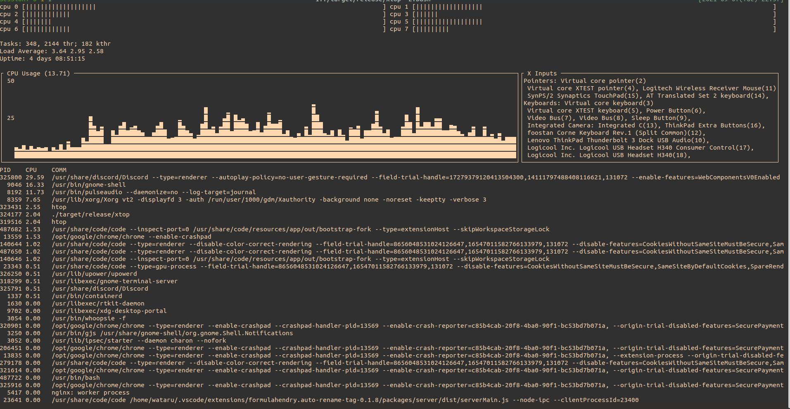

# 🚧 UNDER CONSTRUCTION 🚧

# xtop 

extremely-simplified top

## Depends

`xtop` depends on below relatively primitive crates:
- [`ncurses`](https://github.com/jeaye/ncurses-rs): TUI
- [`sysconf`](https://github.com/zerocostgoods/sysconf.rs): only to get a jiffy.
- [`signal-hook`](https://github.com/vorner/signal-hook): to handle `SIGWINCH`.

## Env

Intended only on Linux(Ubuntu).

## Progress

| Status | Functionality |
| ------------- | ------------- |
| 🌤 | CPU Graph |
| 🌤 | CPU Meter |
| 🌤 | XInput list |
| 🌤 | process list |
| ☀ | task list |
| ☁ | command window |
| ⛈ | search process |
| ⛈ | scrollable process list |
| ⛈ | modest colorize |

### legend

- ☀️: completed
- 🌤: almost done, still needs more impls 
- ☁️: work in progress
- ⛈: totally untouched
