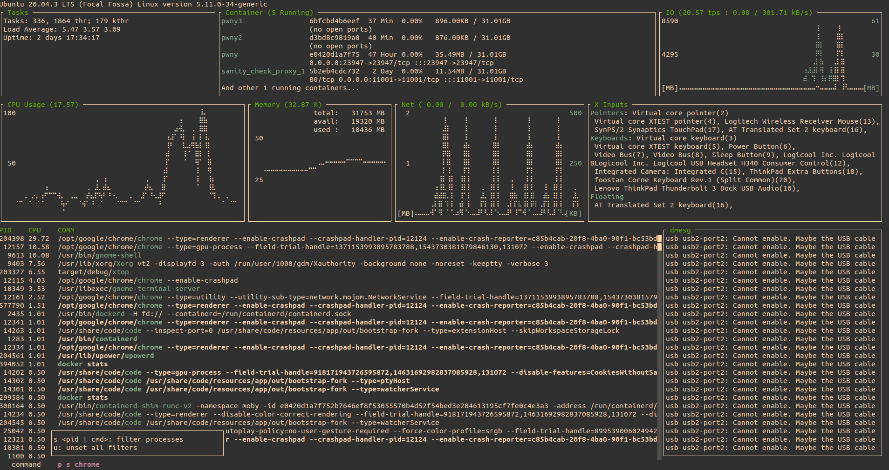

# xtop 

extremely-simplified top

## Depends

`xtop` depends on below relatively primitive crates:
- [`ncurses`](https://github.com/jeaye/ncurses-rs): TUI
- [`sysconf`](https://github.com/zerocostgoods/sysconf.rs): only to get a jiffy.
- [`signal-hook`](https://github.com/vorner/signal-hook): to handle `SIGWINCH`.
- [`serde`](https://github.com/serde-rs/serde): to read layout config from file.

## Env

Intended only on Linux(Ubuntu).
