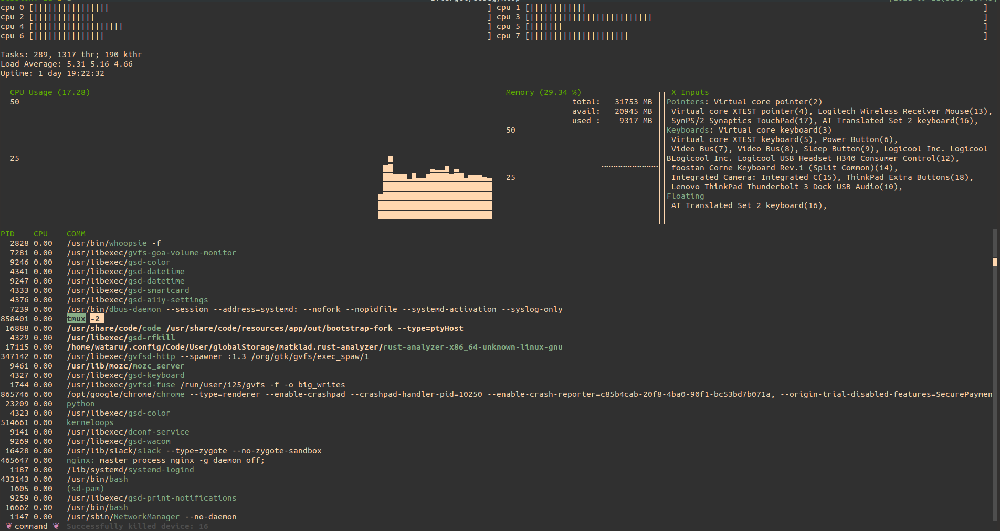

# 🚧 UNDER CONSTRUCTION 🚧

# xtop 

extremely-simplified top

## Depends

`xtop` depends on below relatively primitive crates:
- [`ncurses`](https://github.com/jeaye/ncurses-rs): TUI
- [`sysconf`](https://github.com/zerocostgoods/sysconf.rs): only to get a jiffy.
- [`signal-hook`](https://github.com/vorner/signal-hook): to handle `SIGWINCH`.
- [`serde`](https://github.com/serde-rs/serde): to read layout config from file.

## Env

Intended only on Linux(Ubuntu).

## Features

### Configurable layout

The layout of each component can be configured. Layout can be defined in JSON file. The example config is [`layout.json`](./layout.json). If the layout file is not given, `xtop` uses the default layout.

### Command mode
`xtop` enters command mode by pressing `:`, like `vi`. In this mode, you can do several tiny things.

### TODO
todo

## I likes
`xtop` is inspired by below apps:

- `htop`: I like this system monitor and bought a monitor only to watch this cute app.
- `xinput`

  

## Progress

| Status | Functionality |
| ------------- | ------------- |
| 🌤 | CPU Graph |
| 🌤 | CPU Meter |
| 🌤 | XInput list |
| 🌤 | process list |
| ☀ | task list |
| ☁ | command window |
| ⛈ | search process |
| 🌤 | scrollable process list |
| ☁️ | modest colorize |
| ⛈ | configurable layout |
| ⛈ | network usage |
| ☁️ | memory usage |
| ⛈ | kernel config list |

### legend

- ☀️: completed
- 🌤: almost done, still needs more impls 
- ☁️: work in progress
- ⛈: totally untouched
