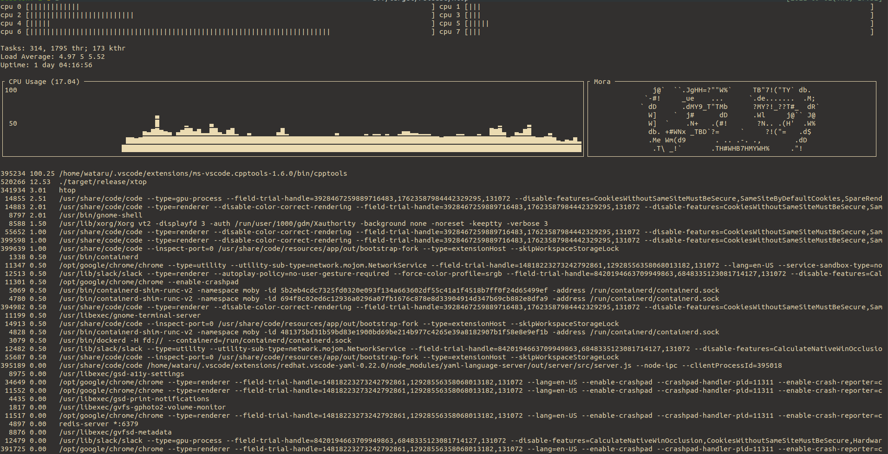

# 🚧 UNDER CONSTRUCTION 🚧

# xtop 

extremely-simplified top

## Depends

`xtop` depends on below relatively primitive crates:
- [`ncurses`](https://github.com/jeaye/ncurses-rs): TUI
- [`sysconf`](https://github.com/zerocostgoods/sysconf.rs): only to get a jiffy.
- [`signal-hook`](https://github.com/vorner/signal-hook): to handle `SIGWINCH`.

## Env

Intended only on Linux(Ubuntu).
